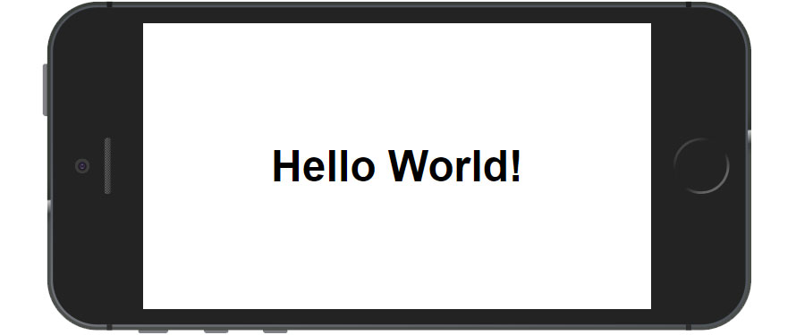

# Hola PWA

     The classic Hello World java program as a Progressive Web App or shell-app. 

## What It Is

Una senzilla demostració de PWA,  que visualitza el text "Hola, món!". Utilitzant un fitxer de manifest d'aplicació, un worker server i local storage caché. Aquesta demostració està escrita en HTML simple , CSS i Javascript (ES6). No té dependències.

Utiliza sintàxis avançada en javascript basada en funcions anònimes, funcions arrow, promises i la nova API fetch de html5. 

## Demo
Github ens permet descarregar l'applicació PWD desd'una URL pública

https://castorden.github.io/pwa/

## Browser Compatibility

Hola món PWA ha estat testejat en els següents browsers:

* Chrome 67 (Windows and Android)
* Firefox 60
* Safari 11
* Edge 42
